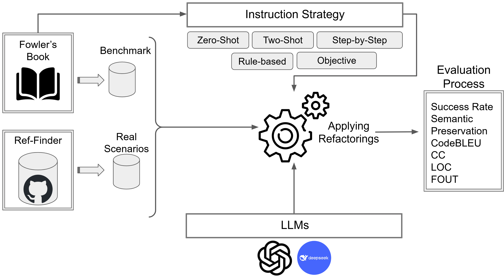

# 🔧 Refactoring with LLM: Bridging Human Expertise and Machine Understanding

This repository provides the **replication package** for the paper:

> [*Refactoring with LLMs: Bridging Human Expertise and Machine Understanding*] (https://arxiv.org/abs/2510.03914)

It enables researchers and practitioners to evaluate how **Large Language Models (LLMs)** perform a diverse ranges of code refactoring under different instruction strategies.



---

## 🚀 Overview

Code refactoring is a fundamental SE task aimed at improving code quality while preserving behavior. However, it is often time-consuming and error-prone that developers avoid code refactoring due to the significant time, effort, and resources it requires, as well as the lack of immediate functional rewards.

This repository provides:

- 📊 A benchmark dataset covering **61 refactoring types** collected based on Fowler catalog
- 🧠 Multiple **instruction strategies** (step-by-step, rule-based, objective, etc.)  
- ⚙️ A full auotmated pipeline to apply LLM-generated refactorings into the benchmark repositories (ANTLR4 and JUnit4)
- 📈 An automated evaluation framework to assess the semantic preservation after refactoring by test suite excecution


---

## 🏗️ Repository Structure
```text
.
├── Data/ # Benchmark collected from examples in Fowler Book + real-world refactoring scenarios collected from ANTLR4 and JUnit4
├── src/ # Core implementation
│     ├── generator/ # LLM-based refactoring generation
│     ├── integrator/ # Applying refactoring into projects
│     ├── evaluation/ # Metrics & validation
│     ├── scripts/ # Execution scripts
└── README.md
```

---

## ⚙️ Pipeline Overview

1. Select a refactoring scenario  
   - Benchmark (Fowler catalog)  
   - Real-world (GitHub projects)

2. Apply instruction strategy  
   - Zero-shot  
   - Few-shot  
   - Step-by-step  
   - Rule-based  
   - Objective-based  

3. Query LLMs  

4. Apply generated refactoring
   - AST-based integration  
   - Code replacement  

5. Evaluate results  
   - Compilation  
   - Test execution  
   - Code quality metrics  

---

## 📊 Evaluation Metrics

We evaluate LLM outputs across:

### ✅ Correctness
- Success rate (manual validation)

### 🔁 Semantic Preservation
- Test suite execution

### 📉 Code Quality
- CodeBLEU  
- Cyclomatic Complexity (CC)  
- Lines of Code (LOC)  
- Fan-out (FOUT)  

---
This repository also includes:

- ✅ Instruction templates  
- ✅ LLM prompting scripts   
- ✅ Reproducible experiments  

---

## ▶️ Getting Started

### 1. Clone the repository
```
git clone https://github.com/arghavanMor/Refactoring_LLM_Benchmark.git
cd Refactoring_LLM_Benchmark
```
### 2. Setup environment
```
conda create -n refactoring-llm python=3.12
conda activate refactoring-llm
pip install -r requirements.txt
```
### 3. Run pipeline

### ⚙️ Configuration

Before running the pipeline, complete the following setup steps:

### API Keys

- Add your DeepSeek API key to `src/generator/DeepSeek_key.txt`
- Add your OpenAI API key to `src/generator/OpenAI_key.txt`
- Add your SonarQube token to `src/integrator/scripts/sonar_utils.py`

### Pipeline Launcher

In the `run_pipeline` launcher, set the following paths:

```python
gpt_api_key_path = "/../OpenAI_key.txt"
deepseek_api_key_path = "/../DeepSeek_key.txt"
```

### Data

Place a copy of the Fowler refactoring book in the `Data/` folder under the name:

```
Data/Fowler.pdf
```


```
python scripts/run_pipeline.py
```
### 4. Citation

```
@article{refactoring_llm_2025,
  title={Refactoring with LLMs: Bridging Human Expertise and Machine Understanding},
  author={Yonnel Chen Kuang Piao, Jean Carlors Paul, Leuson Da Silva, Arghavan Moradi Dakhel, Mohammad Hamdaqa, Foutse Khomh},
  year={2025}
}
```
